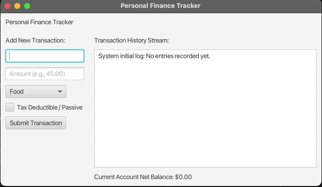
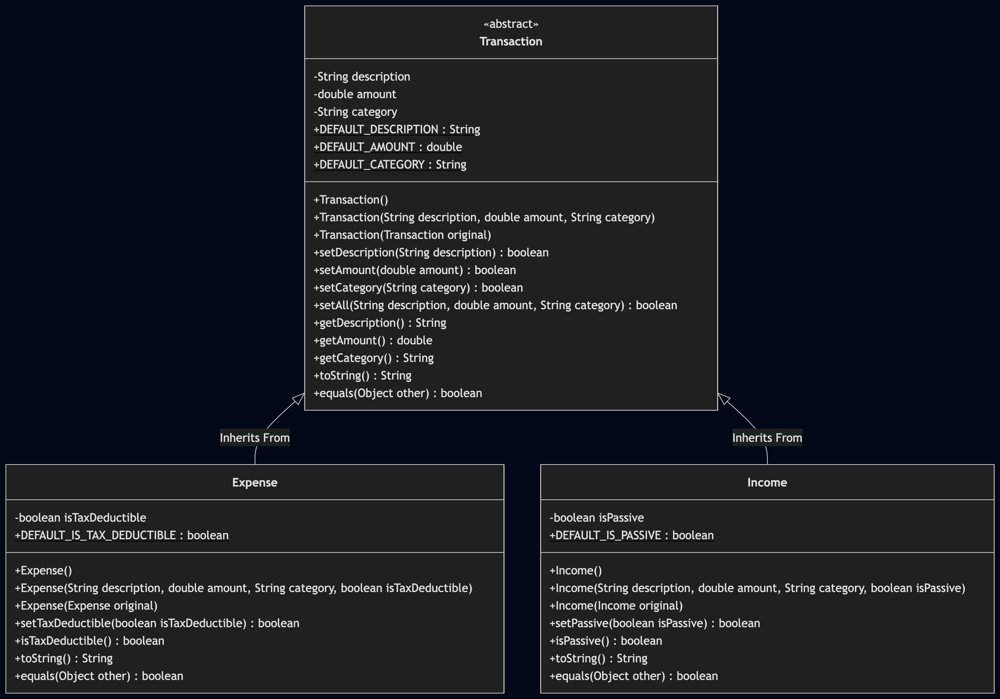
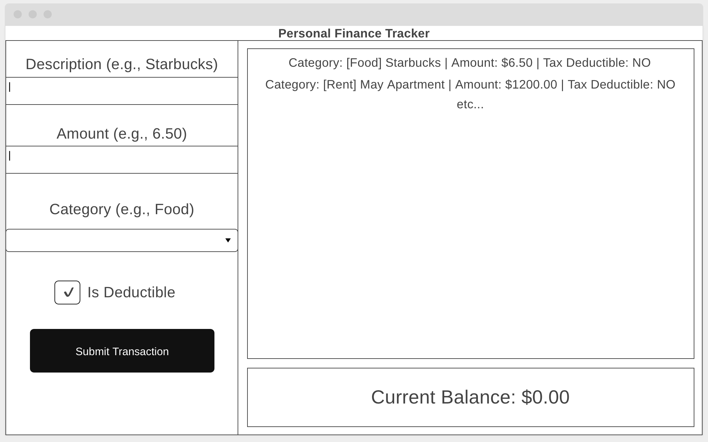

# Unit Deliverable 3 - Final Project
<h2>Personal Expense Tracker</h2>
This project is a personal expense tracker in which users can log their transactions, expenses and incomes to calculate their balance. Users can add transactions through the GUI, after which all transactions will show up on the right side of the program as shown below in the wireframe. The program will calculate the total balance of all of the transactions logged.
I chose to create this project because I think that tracking expenses and making sure that you know what you're spending on is an important life skill. I'm only in my first year of community college (I graduated from HS in June 2025), so I want to get better at managing my money before I go to a 4 year college.

## Demo

## UML Diagram

## Wireframe
